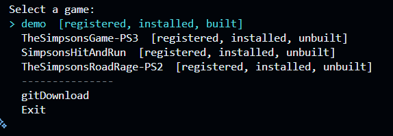
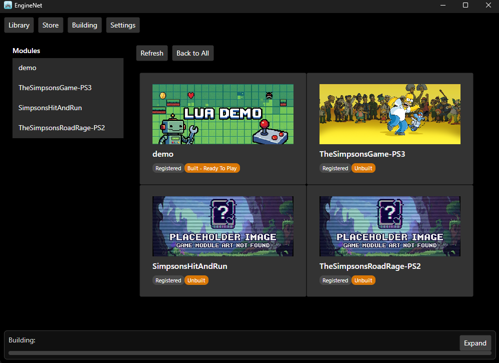

# RemakeEngine Interfaces

RemakeEngine provides three distinct user interfaces: the **GUI** (Graphical User Interface), the **TUI** (Terminal User Interface), and the **CLI** (Command Line Interface).

While the GUI and TUI are designed to explore and execute predefined workflows found in `operations.toml` files, the **CLI** supports both ad-hoc execution and direct execution of manifest-defined operations.

## How The Interfaces Connect To Core

All interfaces are launched by `EngineNet.Program` and orchestrated through `Interface.Main`, which exposes a limited `MiniEngineFace` to the UI layer. This keeps the UI safe and focused, while the engine core remains responsible for registries, operations, command execution, and script dispatch.

## 1\. The Command Line Interface (CLI)

**Primary Use Case:** Automation, CI/CD pipelines, and executing arbitrary scripts without modifying configuration files.

The CLI remains unique because **it does not require an `operations.toml` file to function**. Unlike the other interfaces which act as "players" for defined operations, the CLI can also act as a "builder." You may still construct the operation directly using arguments at runtime, or ask the CLI to execute a file-defined operation by name or ID.

### How it works

Instead of selecting an operation by name or ID from a list, you provide the operation's components (script path, type, arguments) directly to the executable.

  * **Bypasses Definitions:** You do not need to register a script in a game's config file to run it.
  * **Inline Construction:** The operation is assembled in memory based on your flags (`--script`, `--game`, `--arg`).
  * **Ad-Hoc Execution:** Useful for testing a new script quickly or running one-off maintenance tasks that don't warrant a permanent entry in the operations list.
  * **Manifest Execution:** Use `--run_op` or `--run_all` to execute operations already defined in a module's `operations.toml` or `operations.json` file.
  * **Module Resolution:** `--game_module` accepts a registered module's exact name, registered ID, or a filesystem path, in that order.

**Example:**

```pwsh
# Explicitly defines the operation structure in the command itself
dotnet run -c Debug --project EngineNet --framework net10.0 -- --game_module ".\EngineApps\Games\demo\" --script_type lua --script "{{Game_Root}}/scripts/lua_feature_demo.lua" --args '["--module", "{{Game_Root}}", "--scratch", "{{Game_Root}}/TMP/lua-demo", "--prompt", "prompt override", "--note", "This is a note from the prompt"]'
```

*Note: The CLI still supports inline construction, but it can now also execute predefined operations by exact name or numeric ID, and it can run a module's configured run-all sequence directly.*

## 2\. The Terminal User Interface (TUI)

**Primary Use Case:** Interactive development and exploration of predefined workflows.

The TUI is an interactive menu system that runs inside the terminal. Unlike the CLI, it is **strictly file-driven**. It relies entirely on the structure defined in `operations.toml` to populate its menus.

### How it works

1.  **Discovery:** It scans the engine registries to list available games.
2.  **Parsing:** Once a game is selected, it locates and parses the `operations.toml` file.
3.  **Execution:** It presents the parsed operations as a selectable list. You cannot run a script via the TUI unless it is explicitly defined in that file.

This interface ensures consistency; users can only execute workflows that the module creator has officially defined and tested.



## 3\. The Graphical User Interface (GUI)

**Primary Use Case:** General user experience, visual feedback, and complex parameter entry.

Like the TUI, the GUI is **file-driven**. It parses `operations.toml` to generate a visual dashboard of buttons and lists. It is designed to abstract the underlying scripts away from the user, presenting them as "Features" or "Tools."

### How it works

  * **Visual Loading:** Upon selecting a module, the GUI loads the operations list into memory.
  * **Rich Interaction:** It supports interactive features defined in the operations file, such as confirmation dialogs, checkboxes, and text prompts, which are rendered as actual windows rather than text queries.
  * **State Awareness:** It uses the file metadata to display icons, descriptions, and verification status, which the CLI and TUI largely ignore.





## Related Docs
- [../../readme.md](../../readme.md)
- [../../../Readme.md](../../../Readme.md)
- [../Core/readme.md](../Core/readme.md)
- [../ScriptEngines/Readme.md](../ScriptEngines/Readme.md)

